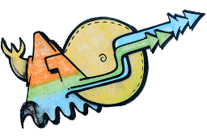
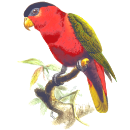



# Normai's Projects

Here is an overview on my [GitHub](https://github.com/normai/) and [GitLab](https://gitlab.com/normai/) projects.

## Dotnet/C-Sharp/VB :

###  &nbsp; [DataSet4Access](https://github.com/normai/DataSet4Access)

Platform : Visual Basic with Visual Studio Community 2017 edition against an Access 2007 database file

Slogan : Accomplish a trivial sounding but in fact devilish mission

Summary : Demonstrate how to make a DataSet on a WinForm work against an Access 2007 database file with hierarchical table relations. 

Status : Good enough to provide the cornerstones

###  &nbsp; [DingsdaDemos](https://github.com/normai/DingsdaDemos)

Platform : C-Sharp, Visual Studio 2017, .NET 4.6.1

Slogan : Demonstrate some non-trivial C-Sharp

Summary : This solution demonstrates inheritance, interfaces and IEnumerator.

Status : A little bit bloated, should be condensed and renamed.

###  &nbsp; [QueryPony](https://github.com/normai/QueryPony)

Platform : C-Sharp/.NET

Slogan : A Simple Generic Database Query Tool and API

Summary : With QueryPony, you can connect to various databases, view the tables, issue SQL statements and view the results. Supported databases are MS-SQL, MySQL, ODBC, OleDb, Oracle, PostgreSQL, SQLite.

Status : Proof-of-concept. Probably needs solution-upgrading

## JavaScript :

###  &nbsp; [canvasgear](https://github.com/normai/canvasgear)

Platform : JavaScript

Slogan : Draw animated canvases by specifying parameters in a data attribute

Summary : CanvasGear is a script to draw animated canvases by just specifying some parameters in the HTML.

Status : Works, but has only few boring algorithms on board

###  &nbsp; [slidegear](https://github.com/normai/slidegear)

Platform : JavaScript

Slogan : Yet another JavaScript slideshow

Summary :

Status : Works

###  &nbsp; [Purple Terminals](https://github.com/normai/terminaljs) (terminaljs)

Platform : JavaScript

Slogan : Single-file JavaScript to put up terminals on a web page

Summary :

Status : Applicable.

###  &nbsp; [wheel-of-fortune](https://gitlab.com/normai/wheel-of-fortune)

Platform : JavaScript

Slogan : A Control to pick a random number from a HTML page.

Summary : This is a small JavaScript control to pick a random integer
 between one and any desired. It comes with a sound effect like that
 of a real wheel of fortune. Numbers can be replaced by names.

Status : It works. There is room for enhancement.

## PHP :

###  &nbsp; [contao-speisekarte](https://github.com/normai/contao-speisekarte)

Platform : PHP/Contao

Slogan : This is a Contao extension to put a Speisekarte on the site.

Summary :

Status : Works

Note : Forked from [LinkingYou/contao-speisekarte](https://github.com/LinkingYou/contao-speisekarte)

###  &nbsp; [php-login-xdb](https://github.com/normai/php-login-xdb)

Platform : PHP/[php-login](https://github.com/panique/php-login)

Slogan :

Summary : This is a fork from [php-login](https://github.com/panique/php-login),
 with the only difference, that it allows to use for the database not only MySQL,
 but PostgreSQL and SQLite as well. The current version is a first proof-of-concept.

Status : Works, but is no more updated since 2014.

Note : The interesting files are
 (1) [PdoDbMore.php](https://github.com/normai/php-login-xdb/blob/master/application/PdoDbMore.php)
 which provides helper functions, so MySQL targetting code can be used for SQLite and PostgreSQL
 (2) A Perl script [/PhpDbSwitch/patch.pl](https://downtown.trilo.de/svn/phplogin/trunk/PhpDbSwitch/patch.pl)
 which converts MySQL-PHP code to the more general code.
 See [downtown.trilo.de/svn/phplogin/trunk/PhpDbSwitch/](https://downtown.trilo.de/svn/phplogin/trunk/PhpDbSwitch/index.html).

###  &nbsp; [rest-api-test-example](https://github.com/normai/rest-api-test-example)

Platform : PHP/Composer/Guzzle/PHPUnit

Slogan : Demonstrate using Guzzle for testing REST API's with PHPUnit.

Status : No more updated since 2014

Note : Forked from [o/rest-api-test-example](https://github.com/o/rest-api-test-example)
 to contribute a little fix

###  &nbsp; [tickeditack](https://gitlab.com/normai/tickeditack)

Platform : PHP/JavaScript

Slogan : Demonstrate time telling with PHP and JavaScript

Status : Works

&nbsp;

*Norbert, 2021-Oct-29*

File 20211029°0751 ܀Ω
