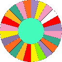

<!-- img src="./icos/20151109o201812.wallpaintinglogoflat.v0.x0256y0168.png" align="right" width="204" height="134" alt="Logo 20151109°201812" -->

# Normai's Projects

Here is an overview on my [GitHub](https://github.com/normai/) and [GitLab](https://gitlab.com/normai/) projects.

<!-- ## Dotnet/C-Sharp/VB : -->

###   &nbsp; [DataSet4Access](https://github.com/normai/DataSet4Access)

A **Visual Basic** project with an **Access 2007** database file.
 It is accomplish a trivial sounding but in fact devilish mission.
 Summary&nbsp;: Demonstrate how to make a DataSet on a WinForm work against an
 Access database file with **hierarchical table relations**. 
 Status&nbsp;: Good enough to provide the cornerstones.

###   &nbsp; [DingsdaDemos](https://github.com/normai/DingsdaDemos)

 A C-Sharp project to *demonstrate some non-trivial C-Sharp language features*.
 Summary&nbsp;: This solution demonstrates e.g. inheritance, interfaces and IEnumerator.
 Status&nbsp;: A little bit bloated, should be condensed and renamed.

###   &nbsp; [QueryPony](https://github.com/normai/QueryPony)

A C-Sharp project with *A Simple Generic Database Query Tool and API*.
 Summary&nbsp;: Connect to various databases, view tables, issue SQL statements and view the results.
 Supported databases are MS-SQL, MySQL, ODBC, OleDb, Oracle, PostgreSQL, SQLite.
 Status&nbsp;: Proof-of-concept. Needs upgrading

<!-- ## JavaScript : -->

###   &nbsp; [canvasgear](https://github.com/normai/canvasgear)

A JavaScript library to draw animated canvases by just specifying parameters in a data attribute.
 Summary&nbsp;: CanvasGear is a script to draw animated canvases by just specifying some parameters in the HTML.
 Status&nbsp;: Works, but has only few boring algorithms on board

###   &nbsp; [slidegear](https://github.com/normai/slidegear)

Yet another JavaScript slideshow.
 Status&nbsp;: It works.

###   &nbsp; [Purple Terminals](https://github.com/normai/terminaljs) (terminaljs)

A single-file JavaScript to put up terminals on a web page.
 Status&nbsp;: Applicable.

###   &nbsp; [wheel-of-fortune](https://gitlab.com/normai/wheel-of-fortune)

A JavaScript control to pick a random number from a HTML page.
 Summary&nbsp;: This is a small JavaScript control to pick a random integer
 between one and any desired. It comes with a sound effect like that
 of a real wheel of fortune. Numbers can be replaced by names.
 Status&nbsp;: It works. There is room for enhancement.

<!-- ## PHP : -->

###   &nbsp; [contao-speisekarte](https://github.com/normai/contao-speisekarte)

This is a Contao extension to put a Speisekarte on the site.
 (Contao is a PHP content management system)
 Status&nbsp;: It works.
 Note&nbsp;: Forked from [LinkingYou/contao-speisekarte](https://github.com/LinkingYou/contao-speisekarte)

###   &nbsp; [php-login-xdb](https://github.com/normai/php-login-xdb)

A PHP MVC project to demonstrate simple login.
 Platform&nbsp;: PHP/[php-login](https://github.com/panique/php-login)
 Summary&nbsp;: This is a fork from [php-login](https://github.com/panique/php-login),
 with the only difference, that it allows to use for the database not only MySQL,
 but PostgreSQL and SQLite as well. The current version is a first proof-of-concept.
 Status : Works, but is no more updated since 2014.
 Note&nbsp;: The interesting files are
 (1) [PdoDbMore.php](https://github.com/normai/php-login-xdb/blob/master/application/PdoDbMore.php)
 which provides helper functions, so MySQL targetting code can be used for SQLite and PostgreSQL
 (2) A Perl script [/PhpDbSwitch/patch.pl](https://downtown.trilo.de/svn/phplogin/trunk/PhpDbSwitch/patch.pl)
 which converts MySQL-PHP code to the more general code.
 See [downtown.trilo.de/…/PhpDbSwitch/](https://downtown.trilo.de/svn/phplogin/trunk/PhpDbSwitch/index.html).

###   &nbsp; [rest-api-test-example](https://github.com/normai/rest-api-test-example)

A PHP/Composer/Guzzle/PHPUnit project demonstrating 
 *how to use Guzzle for testing REST API's* with PHPUnit.
 Status&nbsp;: No more updated since 2014.
 Note&nbsp;: Forked from [o/rest-api-test-example](https://github.com/o/rest-api-test-example)
 to contribute a little fix

###    &nbsp; [tickeditack](https://gitlab.com/normai/tickeditack)

A PHP/JavaScript project to
 *demonstrate time telling with PHP and JavaScript*.
 Status&nbsp;: Works

---

#### Credits

- The Visual Basic logo comes from
 [icons8.com/](https://icons8.com/icon/DuGs7KGIXkDA/microsoft-visual-basic-6)

- The C# logo comes from
 [logodix.com](https://logodix.com/logos/773659)

- The JavaScript logo comes from
 [logodix.com](https://logodix.com/logos/374972)

- About where the other logos come from, see the respective projects

&nbsp;

*Norbert, 2021-Dec-19*
*Norbert, 2021-Oct-29*

*[File 20211029°0751]* ܀Ω
